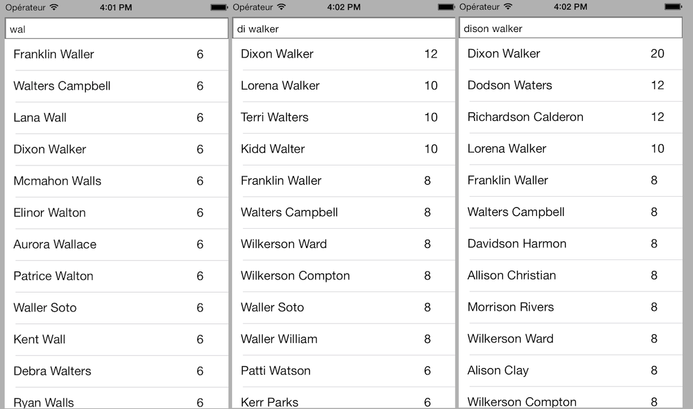

PermissiveResearch
==================

An iOS search engine that allows mistakes in the searched element in huge data.
Many developpers would have executed a fectch request on a CoreData database or a predicate to filter on a NSArray.



PermissiveResearch is a alternative to simplify the search step.
Advantages : 
- No more problems with CoreData (context/thread),
- Performances,
- 100% resusable for each projects that need to perform analysis in huge data,
- Search algorithm are easy customizable,
- 3 algorithms already implemented, 


### Algorithm
It's a custom implementation of the [Smith-Waterman algorithm][1].
The purpose of the algorithm is to obtain the optimum local alignment.
A similarity matrix is use to tolerate errors.
[1]: http://en.wikipedia.org/wiki/Smith–Waterman_algorithm

### Shared instance
```objective-c
[[PermissiveResearchDatabase sharedDatabase] setDatasource:self];
```

### Datasource method to fill your search database
```objective-c
-(void)rebuildDatabase
```

Example :

```objective-c
///PermissiveResearchDatabase datasource
-(void)rebuildDatabase
{
    NSString *jsonPath = [[NSBundle mainBundle] pathForResource:@"data5000"
                                                         ofType:@"json"];
    NSData *data = [NSData dataWithContentsOfFile:jsonPath];
    NSError *error = nil;
    id json = [NSJSONSerialization JSONObjectWithData:data
                                              options:kNilOptions
                                                error:&error];
    NSMutableArray *list = [NSMutableArray new];
    for (NSDictionary *dict in json) {
        [list addObject:dict];
        [[PermissiveResearchDatabase sharedDatabase] addRetainedObjet:dict forKey:[dict objectForKey:@"name"]];
    }
    
    self.searchedList = list;
}
```


### Create your first search operation
```objective-

    [[ScoringOperationQueue mainQueue] cancelAllOperations]
    HeuristicScoringOperation *ope = [[HeuristicScoringOperation alloc] init];
    ope.searchedString = searchedString;
    
    SearchCompletionBlock block = ^(NSArray *results) {
        dispatch_async(dispatch_get_main_queue(), ^{
            self.findedElements = results;
            NSLog(@"finded elements %@", results);
        });
    };
    
    [ope setCustomCompletionBlock:block];
    [[ScoringOperationQueue mainQueue] addOperation:ope];

```

### Actualy 3 operations are available, usage depends on the performance you need. 
Algorithms complexities are very differents.
HeuristicScoringOperation < HeurexactScoringOperation << ExactScoringOperation

```objective-c
ExactScoringOperation
HeuristicScoringOperation
HeurexactScoringOperation
```

### TODO
- Tolerate keyboard errors, very proximal letters can be tolerate.


